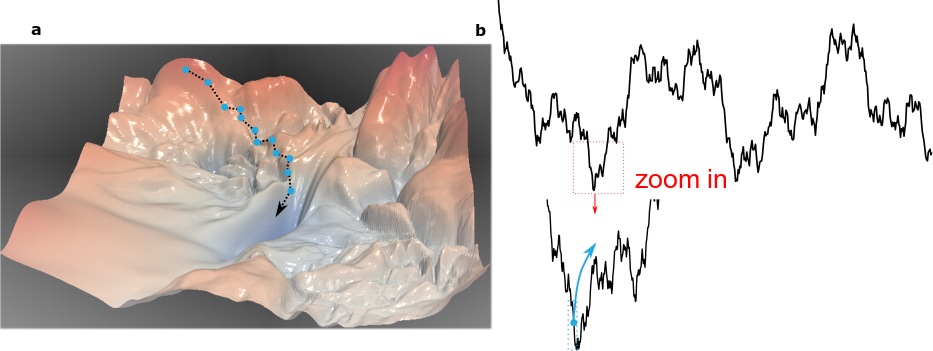

# Anomalous diffusion dynamics of learning in deep neural networks

This repository is the official implementation of "Anomalous diffusion dynamics of learning in deep neural networks, 2020". 

As the SGD can be regarded as a random walker moves on a non-convex and high-dimensional loss-landscape, we use the mean-squared displacement (MSD) to quantify the diffusive process of the SGD training process.
Furthermore, we found that the anomalous diffusion dynamics of SGD is due to the interaction of SGD and fractal-like loss-landscape.



Given a network architecture, this tool characterizes the anomalous diffusion of SGD dynamic during the training process of DNNs and illustrate the fractal-like structure of loss-landscape.

## Requirements

To install requirements:

```setup
pip install -r requirements.txt
```

## Training

To train the model(s) in the paper, run this command:

```train
python -m main --model='resnet14' --epochs=500  --batch_size=1024
python -m main --model='resnet20' --epochs=500  --batch_size=1024
python -m main --model='resnet14_noshort' --epochs=500  --batch_size=1024
python -m main --model='resnet20_noshort' --epochs=500  --batch_size=1024
```

All available models are in folder /train_DNN_code/

## Calculate top 20 eigenvalues of Hessian matrix
python hessian.compute_hessian_eig_GZ.py --cuda --batch_size=128 --model='resnet14' --model_folder='path/to/trained_nets/resnet14_sgd_lr=0.1_bs=1024_wd=0_mom=0_save_epoch=1' --num_eigenthings=20

## Post-analysis

To analyze the anomalous diffusion learning dynamics of SGD, run:
```analysis
MATLAB_SOURCE_PATH="/path/to/post_analysis"
MATLAB_PROCESS_FUNC="post_analysis"
WORKDIR="/path/to/working/directory"

for i in 1 2 3 4
do
matlab  -nodisplay  -r "cd('${MATLAB_SOURCE_PATH1}'), addpath(genpath(cd)), cd('${WORKDIR}') , \
                                                   cd('${MATLAB_SOURCE_PATH2}'), addpath(genpath(cd)), cd('${WORKDIR}'), \
						   cd('${DATA_DIR}'), ${MATLAB_PROCESS_FUNC}(${i}), exit"
done
```

## Simplified model of SGD

To shed light on the anomalous diffusion learning dynamics of SGD, run:
```simplified model
MATLAB_SOURCE_PATH="/path/to/post_analysis"
MATLAB_PROCESS_FUNC="simplified_SGD_model"
WORKDIR="/path/to/working/directory"
LANDSCAPE_TYPE="fractal"
matlab  -nodisplay  -r "cd('${MATLAB_SOURCE_PATH1}'), addpath(genpath(cd)), cd('${WORKDIR}') , \
                                                   cd('${MATLAB_SOURCE_PATH2}'), addpath(genpath(cd)), cd('${WORKDIR}'), \
						   cd('${DATA_DIR}'), ${MATLAB_PROCESS_FUNC}(${LANDSCAPE_TYPE}), exit"
```

## Results

Based on the results, we find that the SGD exhibits rich, complex dynamics when navigating through the loss landscape; initially, the SGD exhibits anomalous superdiffusion, which attenuates gradually and changes to subdiffusion at long times when the solution is reached. Such learning dynamics happen ubiquitously in different DNNs such as ResNet and VGG-like networks and are insensitive to batch size and learning rate. The anomalous superdiffusion process during the initial learning phase indicates that the motion of SGD along the loss landscape possesses intermittent, big jumps; this non-equilibrium property enables the SGD to escape from sharp local minima. By adapting the methods developed for studying energy landscapes in complex physical systems, we find that such superdiffusive learning dynamics are due to the interactions of the SGD and the fractal nature of the loss geometrical structure. We further develop a simple model to demonstrate the mechanistic role of the fractal loss landscape in enabling the SGD to effectively find global minima. Our results thus reveal the effectiveness of deep learning from a novel perspective and have implications for designing efficient deep neural networks.


## Contributing

 Following MIT License


# Citation
If you find this code useful in your research, please cite (currently, it is under review of NIPS, so the code is anonymous):

Anomalous diffusion dynamics of learning in deep neural networks,under review

# Acknowledgements
[1] Hao Li, Zheng Xu, Gavin Taylor, Christoph Studer, Tom Goldstein. On large-batch training for deep learning: Generalization gap and sharp minima. ICLR, 2017.  
[2] Nicolas Douillet (2020). Fractal landscape generator (https://www.mathworks.com/matlabcentral/fileexchange/73273-fractal-landscape-generator), MATLAB Central File Exchange. Retrieved June 9, 2020.  
[3] Noah Golmant, Zhewei Yao, Amir Gholami, Michael Mahoney, Joseph Gonzalez. pytorch-hessian-eigentings: efficient PyTorch Hessian eigendecomposition., https://github.com/noahgolmant/pytorch-hessian-eigenthings, 2018.  
